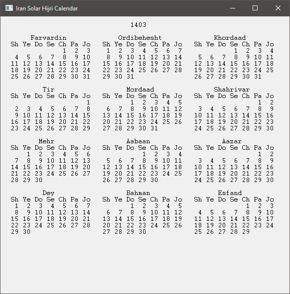

تاریخ هجری شمری را در ویندوز نشان می‌دهد. با کلیک بر روی آیکن پنجره کل سال پیدا یا پنهان می‌شود.
برای خروج یا روی آیکن راست کلیک کنید یا پنجره سال را × کنید.

Shows the current [solar hijri date](https://en.wikipedia.org/wiki/Solar_Hijri_calendar)
in windows taskbar notification area.
